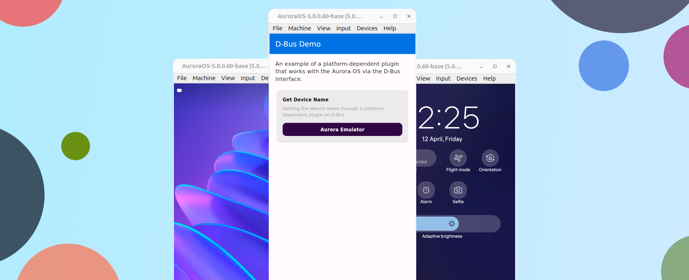

# Реализации плагина с использованием D-Bus 

Пример платформо-зависимого плагина взаимодействующий с операционной системой Аврора через
систему межпроцессного взаимодействия [D-Bus](https://www.freedesktop.org/wiki/Software/dbus/).

> Задача плагина: получить название устройства через D-Bus.



!!! note ""

    Этот демонстрационный плагин доступен в репозитории ["Flutter Plugins"](https://gitlab.com/omprussia/flutter/flutter-plugins)
    в разделе [demo/dbus_demo](https://gitlab.com/omprussia/flutter/flutter-plugins/-/tree/main/demo/dbus_demo).

### 1. Создаем проект

[Flutter CLI](https://docs.flutter.dev/reference/flutter-cli) позволяет создать шаблон плагина.
Плагин на D-Bus является частично-зависимым,
то есть зависит от платформо-зависимого плагина [`dbus`](https://pub.dev/packages/dbus).
Подробнее про типы плагинов можно ознакомится в разделе ["Типы плагинов"](../structure/plugins.md#_1).
Создать такой плагин можно следующей командой:

```shell
flutter-aurora create --template=package --org=ru.aurora dbus_demo
```

- `ru.aurora` - Имя организации ([Organization name](https://doc.qt.io/qt-5/qcoreapplication.html#organizationName-prop)),
участвует в формировании названия пакета.
- `dbus_demo` название плагина ([Application Name](https://doc.qt.io/qt-5/qcoreapplication.html#applicationName-prop)), участвует в
формировании названия пакета.

Данная команда генерирует базовый пример плагина Flutter с настроенным окружением для сборки под ОС Аврора.
Структура файлов и каталогов проекта имеет следующий вид:

```shell
.
├── analysis_options.yaml
├── CHANGELOG.md
├── dbus_demo.iml
├── lib
│   └── dbus_demo.dart
├── LICENSE
├── pubspec.lock
├── pubspec.yaml
├── README.md
└── test
    └── dbus_demo_test.dart

3 directories, 9 files
```

Структура проекта, для разработчика Flutter, должна быть знакома.
Если вы не знакомы с Flutter, с ним можно ознакомится на странице
[документации Flutter](https://docs.flutter.dev/)
и создать свое первое приложение [Write your first Flutter app](https://docs.flutter.dev/get-started/codelab).

### 2. Настройка D-Bus

Пакет `dbus` можно установить из командной строки:

```shell
dart pub global activate dbus
```

В пакете имеются следующие исполняемые файлы:

```shell
dart-dbus
```

`dart-dbus` - приложение CLI, которое позволяет на основе XML интерфейса D-Bus создать привязки для Dart кода.
Запустив приложения в терминале можно увидеть следующий вывод:

```shell
A tool to generate Dart classes from D-Bus interface defintions.

Usage: dart-dbus <command> [arguments]

Global options:
-h, --help    Print this usage information.

Available commands:
  generate-object          Generates a DBusObject to register on the D-Bus.
  generate-remote-object   Generates a DBusRemoteObject to access an object on the D-Bus.

Run "dart-dbus help <command>" for more information about a command.
```

Для того что бы плагин мог работать с D-Bus, следует добавить в зависимости файла `pubspec.yaml`
платформо-зависимый плагин `dbus`, который работает на платформе ОС Аврора:

```yaml
dependencies:
  dbus: ^0.7.10
```

### 3. Генерация привязок

Демонстрационный плагин выполняет задачу по получению названия устройства.
Это можно осуществить через доступную службу интерфейса D-Bus `ru.omp.deviceinfo`.
Подробнее о службе можно ознакомится в документации ОС Аврора ["Device Info API"](https://developer.auroraos.ru/doc/software_development/reference/device_info).

Для генерации привязок нам необходим XML файл с интерфейсом этой службы.
Для получения файла XML с интерфейсом перейдем на эмулятор:

```shell
ssh -i ~/AuroraOS/vmshare/ssh/private_keys/sdk -p 2223 defaultuser@localhost
```

!!! warning

    Путь к ключу может отличиться на вашей машине с установленным Aurora SDK.

Проверим наличие службы D-Bus `ru.omp.deviceinfo`:

```shell
busctl --user list | grep ru.omp.deviceinfo
```

Вывод должен быть следующим:

```shell
ru.omp.deviceinfo.Features    - - - (activatable) - -
ru.omp.deviceinfo.SIM         - - - (activatable) - -
ru.omp.deviceinfo.Storages    - - - (activatable) - -
```

Получим XML интерфейса для генерации `DBusRemoteObject`, нас интересует только раздел `Features`:

```shell
gdbus introspect --system --recurse --xml \
  --dest "ru.omp.deviceinfo" \
  --object-path "/ru/omp/deviceinfo/Features"
```

Команда выдаст в терминал XML код, из которого создадим файл `ru.omp.deviceinfo.Features.xml`
в корне проекта, убрав то что нас не интересует:

```xml
<!DOCTYPE node PUBLIC "-//freedesktop//DTD D-BUS Object Introspection 1.0//EN"
        "http://www.freedesktop.org/standards/dbus/1.0/introspect.dtd">
<node>
    <interface name="ru.omp.deviceinfo.Features">
        <method name="getDeviceModel">
            <arg type="s" direction="out"/>
        </method>
    </interface>
</node>
```

После создания файла XML с интерфейсом нужной службы, запустим генерацию привязок (`DBusRemoteObject`):

```shell
dart-dbus generate-remote-object ru.omp.deviceinfo.Features.xml \
  -o lib/ru_omp_deviceinfo_Features.dart
```

В созданном dart-dbus файле `<project>/lib/ru_omp_deviceinfo_Features.dart` находятся все методы и сингалы интерфейса `ru.omp.deviceinfo.Features`.

### 4. Доработка плагина

Для получения названия устройства можно использовать метод `getDeviceModel` службы `ru.omp.deviceinfo`.
Реализуем в плагине запрос в службу через привязки Dart.
Для этого обновим файл `<project>/lib/dbus_demo.dart` следующим образом:

```dart
library dbus_demo;

import 'package:dbus/dbus.dart';
import 'package:dbus_demo/ru_omp_deviceinfo_Features.dart';

class DbusDemo {
  /// Реализация метода для получения названия устройства.
  Future<String?> getDeviceName() async {
    // Инициализация клиента D-Bus
    final client = DBusClient.system();

    // Инициализация объекта
    final features = RuOmpDeviceinfoFeatures(
      client,
      'ru.omp.deviceinfo',
      DBusObjectPath('/ru/omp/deviceinfo/Features'),
    );

    // Выполнение метода
    final deviceName = await features.callgetDeviceModel();

    // Закрытие клиента D-Bus
    await client.close();

    // Возвращение результата
    return deviceName == '' ? null : deviceName;
  }
}
```

Для обновления зависимостей плагина выполним команду в корне проекта:

```shell
flutter-aurora pub get
```

### 5. Добавление примера

Для Dart-библиотеки демо-приложение (`example`) использующий плагин не создается.
Добавить его можно командой для создания приложений в корне проекта плагина:

```shell
flutter-aurora create --platforms=aurora --template=app --org=ru.aurora dbus_demo_example \
  && mv dbus_demo_example example
```

Перейдем в директорию `example`, подключим плагин `dbus_demo` в `pubspec.yaml`:

```yaml
dependencies:
  dbus_demo:
    path: ../
```

Для повышения читаемости кода, систематизации и упрощения написания приложений-примеров
был разработан плагин `internal_aurora`.
Более детально с ним можно ознакомится в разделе ["Пакет Internal"](../structure/plugins.md#internal).
Добавить в зависимость плагин `internal_aurora` можно следующим образом:

```yaml
dependencies:
  internal_aurora:
    git:
      url: https://gitlab.com/omprussia/flutter/flutter-plugins.git
      ref: internal_aurora-1.0.0
      path: packages/internal_aurora
```

Обновим зависимости в директории `example`:

```shell
cd example
flutter-aurora pub get
```

Доработаем приложение которые будет использовать плагин `dbus_demo` и демонстрировать название устройства:

```dart
import 'package:dbus_demo/dbus_demo.dart';
import 'package:flutter/material.dart';
import 'package:internal_aurora/list_item_data.dart';
import 'package:internal_aurora/list_item_info.dart';
import 'package:internal_aurora/list_separated.dart';
import 'package:internal_aurora/theme/colors.dart';
import 'package:internal_aurora/theme/theme.dart';

void main() {
  runApp(const MyApp());
}

class MyApp extends StatefulWidget {
  const MyApp({super.key});

  @override
  State<MyApp> createState() => _MyAppState();
}

class _MyAppState extends State<MyApp> {
  final DbusDemo _plugin = DbusDemo();

  @override
  Widget build(BuildContext context) {
    return MaterialApp(
      theme: internalTheme,
      home: Scaffold(
        appBar: AppBar(
          title: const Text('D-Bus Demo'),
        ),
        body: ListSeparated(
          children: [
            const ListItemInfo("""
            An example of a platform-dependent plugin that works with the
            Aurora OS via the D-Bus interface.
            """),
            ListItemData(
              'Get Device Name',
              InternalColors.purple,
              description:
              'Getting the device name through a platform-dependent plugin on D-Bus',
              future: _plugin.getDeviceName(),
            ),
          ],
        ),
      ),
    );
  }
}
```

Добавим необходимые разрешения в файл `<project>/aurora/desktop/ru.aurora.dbus_demo.desktop`
для получения доступов к службе `ru.omp.deviceinfo`.

```desktop
Permissions=DeviceInfo
```

Теперь можно собрать приложение.
В корне проекта выполнить команду Flutter CLI для сборки приложения и получения установочного файла RPM.

```shell
flutter-aurora build aurora --target-platform aurora-x64 --release
```

!!! info

    В данном случае в команде на сборку указана архитектура `--target-platform aurora-x64` (`x86_64`)
    на которой работает эмулятор.
    Для сборки доступны и другие архитектуры, более детально с этим вопросом можно ознакомится в разделе
    ["Target platform"](../examples/build.md#1-target-platform).

После успешной сборки можно наблюдать следующий вывод в терминале:

```shell
┌─ Result ────────────────────────────────────────────────────────────────────────────────────────────┐
│ ./build/aurora/psdk_5.0.0.60/aurora-arm/release/RPMS/ru.aurora.dbus_demo_example-0.1.0-1.x86_64.rpm │
└─────────────────────────────────────────────────────────────────────────────────────────────────────┘
```

Этот путь указывает на установочный RPM пакет который можно
[подписать](../faq/index.md#rpm) и [установить](../faq/index.md#_6)
на эмулятор.

### 6. Плагин готов!

Реализация плагина через D-Bus интерфейс позволяет работать с операционной системой без
имплементации Platform Channel интерфейса на С++.
Самый простой способ реализации платформо-зависимого, или правленее сказать частично-зависимого, плагина.
