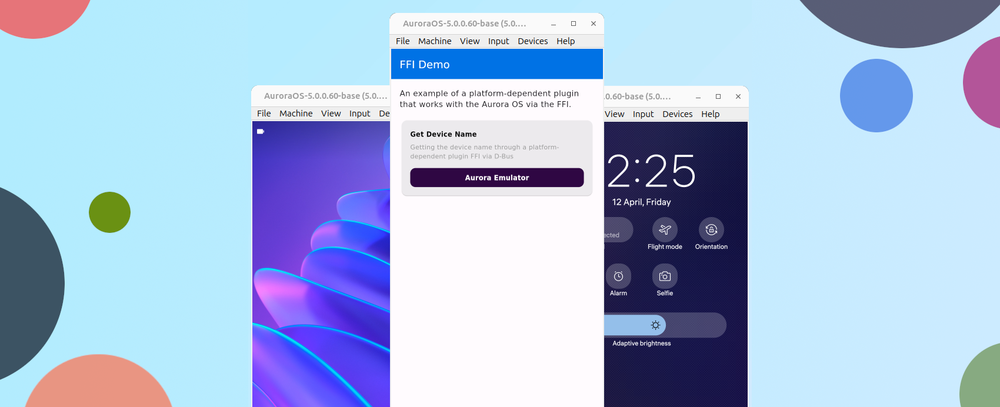

# Реализации плагина с использованием FFI

Пример платформо-зависимого плагина взаимодействующий с операционной системой Аврора с использованием [Foreign function interface](https://en.wikipedia.org/wiki/Foreign_function_interface) (`FFI`).

> Задача плагина: получить название устройства с использованием FFI.



!!! note ""

    Этот демонстрационный плагин доступен в репозитории ["Flutter Plugins"](https://gitlab.com/omprussia/flutter/flutter-plugins)
    в разделе [demo/ffi_demo](https://gitlab.com/omprussia/flutter/flutter-plugins/-/tree/main/demo/ffi_demo).

### 1. Создаем проект

Плагин [FFI](https://www.freedesktop.org/wiki/Software/dbus/) является платформо-зависимым,
то есть зависит от операционной системы.
Подробнее про типы плагинов можно ознакомится в разделе ["Типы плагинов"](../structure/plugins.md#_1).
FFI позволяет использовать библиотеки написанные на `Cи` как основы для написания плагина.
[Flutter CLI](https://docs.flutter.dev/reference/flutter-cli) позволяет создать шаблон плагина.
Для генерации шаблона плагина можно выполнить следующую команду в терминале:

```shell
flutter-aurora create --template=plugin_ffi --platforms aurora --org=ru.aurora ffi_demo
```

- `ru.aurora` - Имя организации ([Organization name](https://doc.qt.io/qt-5/qcoreapplication.html#organizationName-prop)),
  участвует в формировании названия пакета.
- `ffi_demo` название плагина ([Application Name](https://doc.qt.io/qt-5/qcoreapplication.html#applicationName-prop)), участвует в
  формировании названия пакета.

Данная команда генерирует базовый пример плагина Flutter с настроенным окружением для сборки под ОС Аврора.
Структура файлов и каталогов проекта имеет следующий вид:

```shell
.
├── analysis_options.yaml
├── aurora
│   └── CMakeLists.txt
├── CHANGELOG.md
├── example
│   ├── analysis_options.yaml
│   ├── aurora
│   │   ├── CMakeLists.txt
│   │   ├── desktop
│   │   │   └── ru.aurora.ffi_demo_example.desktop
│   │   ├── icons
│   │   │   ├── 108x108.png
│   │   │   ├── 128x128.png
│   │   │   ├── 172x172.png
│   │   │   └── 86x86.png
│   │   ├── main.cpp
│   │   └── rpm
│   │       └── ru.aurora.ffi_demo_example.spec
│   ├── ffi_demo_example.iml
│   ├── lib
│   │   └── main.dart
│   ├── pubspec.lock
│   ├── pubspec.yaml
│   └── README.md
├── ffi_demo.iml
├── ffigen.yaml
├── lib
│   ├── ffi_demo_bindings_generated.dart
│   └── ffi_demo.dart
├── LICENSE
├── pubspec.lock
├── pubspec.yaml
├── README.md
└── src
    ├── CMakeLists.txt
    ├── ffi_demo.c
    └── ffi_demo.h

10 directories, 28 files
```

Структура проекта, для разработчика Flutter, должна быть знакома.
В директории `src` вы найдете код библиотеки C++ которая будет подключена к плагину.
А в директориях `<project>/aurora` и `<project>/example/aurora` находится файлы обеспечивающие работу плагина и приложения на платформе ОС Аврора:

- `CMakeLists.txt` - приложение и плагины Flutter для ОС Аврора имеет платформенную часть на С++, а сборка реализована
  через [CMake](https://cmake.org/).
- `desktop/ru.aurora.app_demo.desktop` - файл интеграции приложения в меню. В нем можно указать название приложения, требуемые права для
  приложения и некоторые другие настройки.
- `icons/*.png` - иконки приложения.
- `main.cpp` - тока входа в приложение для ОС Аврора. Это зачастую шаблонный код для запуска всех необходимых компонентов Flutter и
  приложения.
- `rpm/ru.aurora.app_demo.spec` - файл SPEC можно рассматривать как «рецепт», который утилита rpmbuild использует для фактической сборки
  RPM.

!!! note ""

    Если вы еще не знакомы с Flutter, с ним можно ознакомится на странице
    [документации Flutter](https://docs.flutter.dev/)
    и создать свое первое приложение [Write your first Flutter app](https://docs.flutter.dev/get-started/codelab).

### 2. Настройка FFI

В файле `pubspec.yaml` плагина укажем зависимость от плагина `ffi`:

```yaml
dependencies:
  ffi: ^2.0.2
```

Проверьте наличие активации FFI в файле плагина `pubspec.yaml`:

```yaml
flutter:
  plugin:
    platforms:
      aurora:
        ffiPlugin: true
```

Эта конфигурация вызывает встроенную сборку для различных целевых платформ и объединяет
двоичные файлы в приложение Flutter.

### 3. Генерация привязок

Для генерации привязок, в корне шаблона плагина вы найдете файл `ffigen.yaml`.
Здесь описывается информация с помощью которой можно создать привязки на языке Dart.

```yaml
# Название класса в Dart после генерации
name: FFIDemoBindings
# Описание привязок
description: |
  Bindings for `src/ffi_demo.h`.
# Путь к файлу который должен быть создан
output: 'lib/ffi_demo_bindings_generated.dart'
# Хедеры библиотеки на данных которых создаются привязки
headers:
  entry-points:
    - 'src/ffi_demo.h'
```

На основе файла конфигурации можно выполнить генерацию привязок в файл `<poject>/lib/ffi_demo_bindings_generated.dart`
из корня плагина:

```shell
flutter-aurora pub run ffigen --config ffigen.yaml
```

Команда создаст файл `<project>/lib/ffi_demo_bindings_generated.dart`
с классом `FFIDemoBindings`, который можно использовать для доступа к библиотеке из кода Dart.

### 4. Доработка плагина

Демонстрационный плагин выполняет задачу по получению названия устройства.
Это можно осуществить через доступную службу интерфейса [D-Bus](https://www.freedesktop.org/wiki/Software/dbus/) `ru.omp.deviceinfo`.
Подробнее со службой можно ознакомиться в документации ОС Аврора ["Device Info API"](https://developer.auroraos.ru/doc/software_development/reference/device_info).
Для реализации задачи можно использовать [QtDBus](https://doc.qt.io/qt-5/qtdbus-index.html).

В директории `src` вы найдете код на Си созданный Flutter CLI при генерации шаблона плагина.
В файл `CMakeLists.txt` добавим зависимости которые позволят получить доступ к `QtDBus`:

```cmake
cmake_minimum_required(VERSION 3.10)

project(ffi_demo_library VERSION 0.0.1)

find_package(PkgConfig REQUIRED)
find_package(Qt5 COMPONENTS Core DBus REQUIRED)

add_library(ffi_demo SHARED
  "ffi_demo.cpp"
)

target_link_libraries(ffi_demo PUBLIC Qt5::Core Qt5::DBus)

set_target_properties(ffi_demo PROPERTIES
  PUBLIC_HEADER ffi_demo.h
  OUTPUT_NAME "ffi_demo"
)

target_compile_definitions(ffi_demo PUBLIC DART_SHARED_LIB)
```

!!! info

    Обратите внимание, что файл реализации шаблона `ffi_demo.c` был переименован в `ffi_demo.cpp`.

В файл `<project>/src/ffi_demo.h` укажем функцию для получения названия устройства следующим образом:

```c++
#ifdef __cplusplus
extern "C" {
#endif

char *getDeviceName();

#ifdef __cplusplus
}
#endif
```

И в файле `ffi_demo.cpp` выполним реализацию метода, который через `DBus`,
обратиться к службе `ru.omp.deviceinfo` для получения названия устройства:

```c++
#include <QtDBus/QtDBus>

#include "ffi_plugin_device.h"

char *getDeviceName()
{
    QString deviceName = "";
    if (QDBusConnection::systemBus().isConnected()) {
        QDBusInterface iface("ru.omp.deviceinfo",
            "/ru/omp/deviceinfo/Features",
            "",
            QDBusConnection::systemBus()
        );
        if (iface.isValid()) {
            QDBusReply<QString> reply = iface.call("getDeviceModel");
            if (reply.isValid()) {
                deviceName = reply.value();
            }
        }
    }
    return deviceName.toUtf8().data();
}
```

После модификаций плагина следует обновить привязки библиотеки к языку Dart:

```shell
flutter-aurora pub run ffigen --config ffigen.yaml
```

Dart код плагина можно доработать следующим образом:

```dart
library dbus_demo;

import 'dart:ffi';
import 'package:ffi/ffi.dart';
import 'ffi_demo_bindings_generated.dart';

class FFIDemo {

  /// Привязки к нативным функциям в [_dylib].
  final FFIDemoBindings _bindings = FFIDemoBindings(
    DynamicLibrary.open('libffi_demo.so'),
  );

  /// Реализация метода для получения названия устройства.
  Future<String?> getDeviceName() async {
    // Выполнение метода
    final deviceName = _bindings.getDeviceName().cast<Utf8>().toDartString();
    // Возвращение результата
    return deviceName == '' ? null : deviceName;
  }
}
```

Для обновления зависимостей плагина выполним команду в корне проекта:

```shell
flutter-aurora pub get
```

### 5. Доработка примера

Шаблон `FFI` плагина генерируемый Flutter CLI имеет приложение-пример работы с плагином в директории `example`.
Доработаем его для вывода информации о названии устройства.

Для получения доступа к "Device Info API" требуется добавить разрешение в файл `<plugin>/example/aurora/desktop/ru.aurora.ffi_demo_example.desktop`:

```desktop
Permissions=DeviceInfo
```

Для подключения библиотеки `QtDBus` в файл `<plugin>/example/aurora/rpm/ru.aurora.ffi_demo_example.spec` добавим зависимости:

```spec
BuildRequires: pkgconfig(Qt5Core)
BuildRequires: pkgconfig(Qt5DBus)
```

Для повышения читаемости кода, систематизации и упрощения написания приложений-примеров
был разработан плагин `internal_aurora`.
Более детально с ним можно ознакомится в разделе ["Пакет Internal"](../structure/plugins.md#internal).
Добавить в зависимость плагин `internal_aurora` можно следующим образом:

```yaml
dependencies:
  internal_aurora:
    git:
      url: https://gitlab.com/omprussia/flutter/flutter-plugins.git
      ref: internal_aurora-1.0.0
      path: packages/internal_aurora
```

Обновим зависимости в директории `example`:

```shell
cd example
flutter-aurora pub get
```

Доработаем приложение, которое будет использовать плагин `dbus_demo` и демонстрировать название устройства:

```dart
import 'package:ffi_demo/ffi_demo.dart';
import 'package:flutter/material.dart';
import 'package:internal_aurora/list_item_data.dart';
import 'package:internal_aurora/list_item_info.dart';
import 'package:internal_aurora/list_separated.dart';
import 'package:internal_aurora/theme/colors.dart';
import 'package:internal_aurora/theme/theme.dart';

void main() {
  runApp(const MyApp());
}

class MyApp extends StatefulWidget {
  const MyApp({super.key});

  @override
  State<MyApp> createState() => _MyAppState();
}

class _MyAppState extends State<MyApp> {
  final FFIDemo _plugin = FFIDemo();

  @override
  Widget build(BuildContext context) {
    return MaterialApp(
      theme: internalTheme,
      home: Scaffold(
        appBar: AppBar(
          title: const Text('FFI Demo'),
        ),
        body: ListSeparated(
          children: [
            const ListItemInfo("""
            An example of a platform-dependent plugin that works with the
            Aurora OS via the FFI.
            """),
            ListItemData(
              'Get Device Name',
              InternalColors.purple,
              description:
              'Getting the device name through a platform-dependent plugin FFI via D-Bus',
              future: _plugin.getDeviceName(),
            ),
          ],
        ),
      ),
    );
  }
}
```

Теперь можно собрать приложение.
В корне проекта выполнить команду Flutter CLI для сборки приложения и получения установочного файла RPM.

```shell
flutter-aurora build aurora --target-platform aurora-x64 --release
```

!!! info

    В данном случае в команде на сборку указана архитектура `--target-platform aurora-x64` (`x86_64`)
    на которой работает эмулятор.
    Для сборки доступны и другие архитектуры, более детально с этим вопросом можно ознакомится в разделе
    ["Target platform"](../examples/build.md#1-target-platform).

После успешной сборки можно наблюдать следующий вывод в терминале:

```shell
┌─ Result ───────────────────────────────────────────────────────────────────────────────────────────┐
│ ./build/aurora/psdk_5.0.0.60/aurora-x64/release/RPMS/ru.aurora.ffi_demo_example-0.1.0-1.x86_64.rpm │
└────────────────────────────────────────────────────────────────────────────────────────────────────┘
```

Этот путь указывает на установочный RPM пакет, который можно
[подписать](../faq/index.md#rpm) и [установить](../faq/index.md#_6)
на эмулятор.

### 6. Плагин готов!

Реализация плагина через FFI позволяет работать с операционной системой без имплементации Platform Channel интерфейса.
Это удобный способ для реализации простых платформо-зависимых плагинов.
