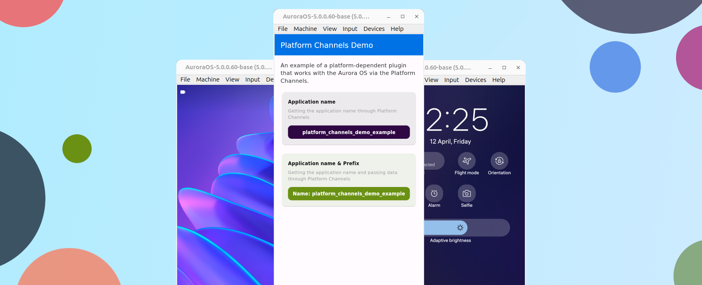

# Реализации плагина с использованием Platform Channels

Пример платформо-зависимого плагина взаимодействующий с ОС Аврора через
[Platform Channels](https://docs.flutter.dev/platform-integration/platform-channels).

> Задача плагина: получить название приложение с использованием Platform Channels.



!!! note ""

    Этот демонстрационный плагин доступен в репозитории
    ["Flutter Plugins"](https://gitlab.com/omprussia/flutter/flutter-plugins)
    в разделе
    [demo/platform_channels_demo](https://gitlab.com/omprussia/flutter/flutter-plugins/-/tree/main/demo/platform_channels_demo).

### 1. Создаем проект

Плагин [Platform Channels](https://docs.flutter.dev/platform-integration/platform-channels) является платформо-зависимым,
то есть зависит от операционной системы.
Подробнее про типы плагинов можно ознакомится в разделе ["Типы плагинов"](../structure/plugins.md#_1).
Platform Channels позволяет реализовать плагин обменивающийся данными через `MethodChannel` или `EventChannel`
с платформо-зависимой частью плагина из Dart части плагина.
Platform Channels так же дает доступ к публичным методам Flutter Embedder.
Для генерации шаблона плагина можно выполнить следующую команду в терминале:

```shell
flutter-aurora create --template=plugin --platforms aurora --org=ru.aurora platform_channels_demo
```

- `ru.aurora` - имя организации ([Organization name](https://doc.qt.io/qt-5/qcoreapplication.html#organizationName-prop)),
  участвует в формировании названия пакета.
- `platform_channels_demo` название плагина ([Application Name](https://doc.qt.io/qt-5/qcoreapplication.html#applicationName-prop)), участвует в
  формировании названия пакета.

Данная команда генерирует базовый пример плагина Flutter с настроенным окружением для сборки под ОС Аврора.
Структура файлов и каталогов проекта имеет следующий вид:

```shell
.
├── analysis_options.yaml
├── aurora
│   ├── CMakeLists.txt
│   ├── include
│   │   └── platform_channels_demo
│   │       ├── globals.h
│   │       └── platform_channels_demo_plugin.h
│   └── platform_channels_demo_plugin.cpp
├── CHANGELOG.md
├── example
│   ├── analysis_options.yaml
│   ├── aurora
│   │   ├── CMakeLists.txt
│   │   ├── desktop
│   │   │   └── ru.aurora.platform_channels_demo_example.desktop
│   │   ├── icons
│   │   │   ├── 108x108.png
│   │   │   ├── 128x128.png
│   │   │   ├── 172x172.png
│   │   │   └── 86x86.png
│   │   ├── main.cpp
│   │   └── rpm
│   │       └── ru.aurora.platform_channels_demo_example.spec
│   ├── integration_test
│   │   └── plugin_integration_test.dart
│   ├── lib
│   │   └── main.dart
│   ├── platform_channels_demo_example.iml
│   ├── pubspec.lock
│   ├── pubspec.yaml
│   ├── README.md
│   └── test
│       └── widget_test.dart
├── lib
│   ├── platform_channels_demo.dart
│   ├── platform_channels_demo_method_channel.dart
│   └── platform_channels_demo_platform_interface.dart
├── LICENSE
├── platform_channels_demo.iml
├── pubspec.lock
├── pubspec.yaml
├── README.md
└── test
    ├── platform_channels_demo_method_channel_test.dart
    └── platform_channels_demo_test.dart

14 directories, 32 files
```

Структура проекта, для разработчика Flutter, должна быть знакома.
Исключением является директория `<project>/aurora` в которой находится С++ код плагина
для взаимодействия с [Flutter Embedder](../structure/platform.md#flutter-embedder)
и реализации общения с кодом плагина на Dart через Platform Channels:

- `CMakeLists.txt` - сборка плагина реализована через [CMake](https://cmake.org/).
- `globals.h` - содержит определение `PLUGIN_EXPORT`.
- `platform_channels_demo_plugin.h` - хедер реализации плагина.
- `platform_channels_demo_plugin.cpp` - реализация плагина.

А в директории `<project>/example/aurora` находится файлы обеспечивающие работу демо-приложения плагина на платформе ОС Аврора:

- `CMakeLists.txt` - приложение и плагины Flutter для ОС Аврора имеет платформенную часть на С++, а сборка реализована
  через [CMake](https://cmake.org/).
- `desktop/ru.aurora.app_demo.desktop` - файл интеграции приложения в меню. В нем можно указать название приложения,
  требуемые права для приложения и некоторые другие настройки.
- `icons/*.png` - иконки приложения.
- `main.cpp` - точка входа в приложение для ОС Аврора. Это зачастую шаблонный код для запуска всех необходимых компонентов Flutter и
  приложения.
- `rpm/ru.aurora.app_demo.spec` - файл SPEC можно рассматривать как «рецепт», который утилита rpmbuild использует для фактической сборки
  RPM.

!!! note ""

    Если вы еще не знакомы с Flutter, с ним можно ознакомится на странице
    [документации Flutter](https://docs.flutter.dev/)
    и создать свое первое приложение [Write your first Flutter app](https://docs.flutter.dev/get-started/codelab).

### 2. Доработка С++ части

Плагин выполняет задачу по получению названия приложения через `Platform Channels`.
Продемонстрирует обращение к функции `Flutter Embedder` и передачу данных через `MethodChannel`.
Модифицируем шаблон под эти задачи.

В корне плагина находится папка `<project>/aurora`, в ней лежит С++ код, реализующий `Platform Channels` плагина.
В папке `lib` лежит Dart часть кода плагина.
В папке `example`, стандартно, пример приложения взаимодействующий с плагином.

Давайте начнем с модификации С++ части плагина. В папке `<project>/aurora` вы найдете хедер в котором
нужно убрать шаблонный метод и добавить свой.
Стандартный нам не подходит - нам нужно получить название приложения:

```c++
// ...
class PLUGIN_EXPORT PlatformChannelsDemoPlugin final : public flutter::Plugin
{
public:
    static void RegisterWithRegistrar(flutter::PluginRegistrar* registrar);

private:
    // Creates a plugin that communicates on the given channel.
    PlatformChannelsDemoPlugin(
        std::unique_ptr<MethodChannel> methodChannel
    );

    // Methods register handlers channels
    void RegisterMethodHandler();

    // Methods MethodCall
    EncodableValue onGetApplicationName(const MethodCall &call);

    // Variables
    std::unique_ptr<MethodChannel> m_methodChannel;
};
// ...
```

Здесь просто добавляем метод `onGetApplicationName` и убираем метод шаблона.
В папке `<project>/aurora` так же есть файл `<project>/aurora/platform_channels_demo_plugin.cpp`, 
в котором нужно реализовать метод:

```c++
// ...
EncodableValue
PlatformChannelsDemoPlugin::onGetApplicationName(const MethodCall &call) {
  if (Encodable::TypeIs<EncodableMap>(*call.arguments())) {
    // Get arguments
    const EncodableMap params =
        Encodable::GetValue<EncodableMap>(*call.arguments());
    // Get prefix
    std::string prefix = Encodable::GetString(params, "prefix");
    // Return data with prefix
    return prefix + aurora::GetApplicationName();
  }
  return aurora::GetApplicationName();
}
// ...
```

Класс `MethodCall` содержит данные переданные из Dart кода которые можно получить в С++ части плагина.
В этом методе есть `namespace Encodable`, в котором есть методы облегчающие работу для работы с данными:

```c++
// ...
namespace Encodable {
template <typename T> inline bool TypeIs(const EncodableValue val) {
  return std::holds_alternative<T>(val);
}

template <typename T> inline const T GetValue(EncodableValue val) {
  return std::get<T>(val);
}

inline std::string GetString(const EncodableMap &map, const std::string &key) {
  auto it = map.find(EncodableValue(key));
  if (it != map.end() && TypeIs<std::string>(it->second))
    return GetValue<std::string>(it->second);
  return std::string();
}
} // namespace Encodable
// ...
```

В методе `onGetApplicationName` происходит вызов метода `aurora::GetApplicationName()`, который реализован во Flutter Embedder.
Все публичные функции Flutter Embedder можно получить подключив хедер `flutter_aurora.h`:

```c++
#include <flutter/flutter_aurora.h>
```

Эти методы, не являются честью интерфейса [Client Wrapper](../structure/plugins.md#client-wrapper), а расширяют функционал по взаимодействию плагинов с платформой.

### 3. Доработка Dart части

Плагин взаимодействует с приложением через Dart часть плагина.
Все базовые элементы для такого плагина уже создал шаблон, это:

- `PlatformChannelsDemo` - сам плагин который подключается в приложение.
- `PlatformChannelsDemoPlatform` - интерфейс, который позволяет расширять плагин.
- `MethodChannelPlatformChannelsDemo` - реализация методов интерфейса плагина.

В Dart части плагина нам нужно подправить все файлы для реализации нашей задачи: получения названия приложения.
Для этого в файле `<plugin>/lib/platform_channels_demo.dart` подправим класс `PlatformChannelsDemo`,
удалив шаблонный метод на необходимый `getApplicationName`:

```dart
class PlatformChannelsDemo {
  Future<String?> getApplicationName({String? prefix}) {
    return PlatformChannelsDemoPlatform.instance.getApplicationName(prefix);
  }
}
```

В методе присутствует опциональный аргумент `prefix` для демонстрации передачи данных с помощью `Platform Channels`.
В файле `<plugin>/lib/platform_channels_demo_platform_interface.dart` обновим методы интерфейса:

```dart
Future<String?> getApplicationName(String? prefix) {
  throw UnimplementedError('getApplicationName() has not been implemented.');
}
```

И последний этап: реализация метода и `Platform Channels` со стороны Dart.
Для этого файл `<plugin>/lib/platform_channels_demo_method_channel.dart` модифицируем следующим образом:

```dart
// Platform plugin keys channels
const channelMethods = "platform_channels_demo";

// Platform channel plugin methods
enum Methods {
  applicationName,
}

/// An implementation of [PlatformChannelsDemoPlatform] that uses method channels.
class MethodChannelPlatformChannelsDemo extends PlatformChannelsDemoPlatform {
  /// The method channel used to interact with the native platform.
  @visibleForTesting
  final methods = const MethodChannel(channelMethods);

  @override
  Future<String?> getApplicationName(String? prefix) async {
    if (prefix == null) {
      return await methods.invokeMethod<String>(Methods.applicationName.name);
    } else {
      return await methods.invokeMethod<String>(Methods.applicationName.name, {
        'prefix': prefix,
      });
    }
  }
}
```

### 4. Доработка примера

Шаблон `Platform Channels` плагина генерируемый Flutter CLI имеет приложение-пример работы с плагином в директории `example`.
Доработаем его для вывода информации о названии приложения через плагин.

Для повышения читаемости кода, систематизации и упрощения написания приложений-примеров
был разработан плагин `internal_aurora`.
Более детально с ним можно ознакомится в разделе ["Пакет Internal"](../structure/plugins.md#internal).
Добавить в зависимость плагин `internal_aurora` можно следующим образом:

```yaml
dependencies:
  internal_aurora:
    git:
      url: https://gitlab.com/omprussia/flutter/flutter-plugins.git
      ref: internal_aurora-1.0.0
      path: packages/internal_aurora
```

Обновим зависимости в директории `example`:

```shell
cd example
flutter-aurora pub get
```

Доработаем приложение, которое будет использовать плагин `platform_channels_demo` и демонстрировать название приложения
и прокидывать префикс (строку, предваряющую название) из Dart кода в C++ и обратно:

```dart
import 'package:flutter/material.dart';
import 'package:internal_aurora/list_item_data.dart';
import 'package:internal_aurora/list_item_info.dart';
import 'package:internal_aurora/list_separated.dart';
import 'package:internal_aurora/theme/colors.dart';
import 'package:internal_aurora/theme/theme.dart';
import 'package:platform_channels_demo/platform_channels_demo.dart';

void main() {
  runApp(const MyApp());
}

class MyApp extends StatefulWidget {
  const MyApp({super.key});

  @override
  State<MyApp> createState() => _MyAppState();
}

class _MyAppState extends State<MyApp> {
  final PlatformChannelsDemo _plugin = PlatformChannelsDemo();

  @override
  Widget build(BuildContext context) {
    return MaterialApp(
      theme: internalTheme,
      home: Scaffold(
        appBar: AppBar(
          title: const Text('Platform Channels Demo'),
        ),
        body: ListSeparated(
          children: [
            const ListItemInfo("""
            An example of a platform-dependent plugin that works with the
            Aurora OS via the Platform Channels.
            """),
            ListItemData(
              'Application name',
              InternalColors.purple,
              description:
                  'Getting the application name through Platform Channels',
              future: _plugin.getApplicationName(),
            ),
            ListItemData(
              'Application name & Prefix',
              InternalColors.green,
              description:
                  'Getting the application name and passing data through Platform Channels',
              future: _plugin.getApplicationName(
                prefix: 'Name: ',
              ),
            ),
          ],
        ),
      ),
    );
  }
}
```

Теперь можно собрать приложение.
В корне проекта выполнить команду Flutter CLI для сборки приложения и получения установочного файла RPM.

```shell
flutter-aurora build aurora --target-platform aurora-x64 --release
```

!!! info

    В данном случае в команде на сборку указана архитектура `--target-platform aurora-x64` (`x86_64`)
    на которой работает эмулятор.
    Для сборки доступны и другие архитектуры, более детально с этим вопросом можно ознакомится в разделе
    ["Target platform"](../examples/build.md#1-target-platform).

После успешной сборки можно наблюдать следующий вывод в терминале:

```shell
┌─ Result ─────────────────────────────────────────────────────────────────────────────────────────────────────────┐
│ ./build/aurora/psdk_5.0.0.60/aurora-x64/release/RPMS/ru.aurora.platform_channels_demo_example-0.1.0-1.x86_64.rpm │
└──────────────────────────────────────────────────────────────────────────────────────────────────────────────────┘
```

Этот путь указывает на установочный RPM пакет который можно
[подписать](../faq/index.md#rpm) и [установить](../faq/index.md#_6)
на эмулятор.

### 5. Плагин готов!

Реализация плагина с использованием `Platform Channels` дает максимальные возможности для реализации плагина.
Flutter Embedder реализует общий интерфейс Client Wrapper, который позволяет легко портировать плагины на другие платформы.
Так же Flutter Embedder реализует методы специфичные для платформы,
которые можно получить через подключение хедера `flutter_aurora.h`. 
