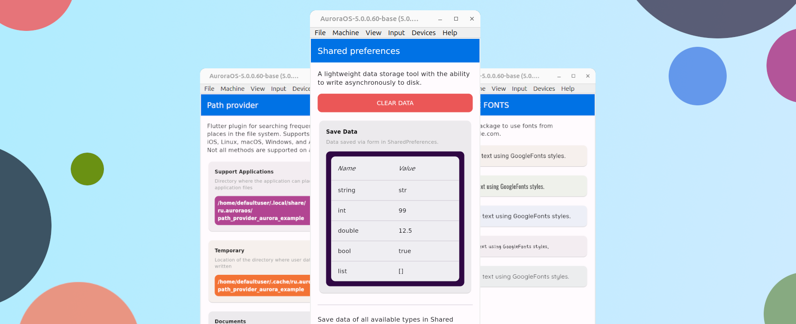

# Установка на Linux

На данный момент Linux - основная среда для работы с Flutter для ОС Аврора.
Рекомендуемый дистрибутив - [Ubuntu](https://ubuntu.com/) (22.04), работа на других возможна, с нюансами этого дистрибутива.
Для настройки рабочего места и установки всех необходимых инструментов следует выполнить следующие шаги:

1. Установить [Aurora SDK](https://developer.auroraos.ru/doc/software_development/sdk).
2. Установить [Platform SDK](https://developer.auroraos.ru/doc/software_development/psdk).
3. Установить [Flutter SDK](https://gitlab.com/omprussia/flutter/flutter).

## 1. Aurora SDK

**Aurora SDK** - это набор инструментов для создания Qt/QML приложений.
Более подробно можно ознакомиться с компонентами в разделе ["О проекте"](../structure/platform.md#sdk).
Подробно установка Aurora SDK описана в документации по SDK с которой можно
ознакомится в разделе документации ["Установка и удаление Аврора SDK"](https://developer.auroraos.ru/doc/software_development/sdk/setup).

Aurora SDK содержит среди других компонентов эмулятор, на котором можно запускать приложения Flutter.



## 2. Platform SDK

**Platform SDK** - предназначен для сборки приложений из командной строки и может использоваться в системах CI/CD.
Более подробно можно ознакомиться с компонентами в разделе ["О проекте"](../structure/platform.md#platform-sdk).

Этот компонент отвечает за сборку приложений в установочный RPM пакет.
Сборка приложений осуществляется Platform SDK через [Flutter CLI](https://docs.flutter.dev/reference/flutter-cli).

Подробно установка Platform SDK описана в документации по SDK с которой можно
ознакомится в разделе документации ["Установка, обновление и удаление Аврора Platform SDK вручную"](https://developer.auroraos.ru/doc/software_development/psdk/setup)
или ["Автоматизированные установка и удаление Аврора Platform SDK"](https://developer.auroraos.ru/doc/software_development/psdk/setup_script).

!!! warning

    Названия таргетов должны соотвестваоть шаблону документации:

    ```shell
    AuroraOS-{version}-base-{architecture}
    ```

    - {version} - версия Platform SDK
    - {architecture} - архитектура таргета: `aarch64` | `armv7hl` | `x86_64`

## 3. Flutter SDK

**Flutter SDK** — фреймворк с открытым исходным кодом который позволяет собрать приложение для разных платформ, в том числе и ОС Аврора.
Фреймворк с поддержкой платформы ОС Аврора доступен в репозитории [Flutter](https://gitlab.com/omprussia/flutter/flutter).
Реализую поддержку платформы ОС Аврора фреймворк, для всех платформ, остается полнофункциональным,
то есть его можно использовать и для разработки других платформ.

Для установки Flutter SDK требуется сначала установить зависимости:

```shell
sudo apt update && sudo apt install curl git git-lfs unzip bzip2
```

Создать папку где будет расположен Flutter SDK:

```shell
mkdir -p ~/.local/opt
```

И клонировать проект Flutter SDK в созданную папку:

```shell
git clone --branch {version}\
  https://gitlab.com/omprussia/flutter/flutter.git ~/.local/opt/flutter-{version}
```

!!! info "`{version}`"

    

    Все доступные версии можно узнать в репозитории на [странице тегов](https://gitlab.com/omprussia/flutter/flutter/-/tags).


Для удобства вызова командной строки Flutter добавляем `alias` в `~/.bashrc`:

```shell
echo "alias flutter-aurora=$HOME/.local/opt/flutter-{version}/bin/flutter" >> ~/.bashrc
```

Применяем изменения `~/.bashrc`:

```shell
source ~/.bashrc
```

Во Flutter CLI доступна команда `doctor` которая позволяет проверить все ли компоненты необходимые для сборки установлены верно:

!!! info

    Подробнее о командах доступных для платформы ОС Аврора можно узнать в разделе ["Поддержка Flutter CLI"](../support/cli.md).

```shell
flutter-aurora doctor
```

Если после выполнения в выводе есть следующие:

```
[✓] Aurora toolchain - develop for Aurora OS
```

**Flutter для ОС Аврора готов к работе!**

Логика работы с Flutter CLI та же что и с другими платформами.
С деталями сборки приложения можно ознакомится в разделе ["Примеры"](../examples/build.md).
