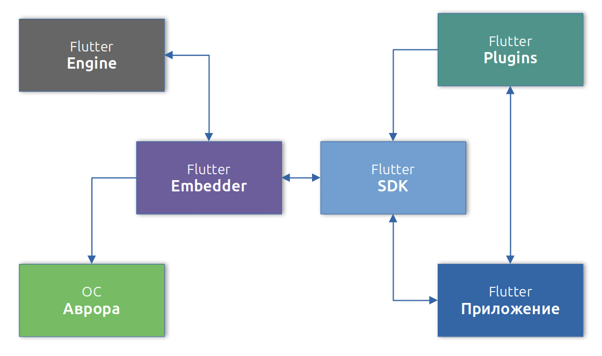

#  Состав Flutter для ОС Аврора

Проект "Flutter для ОС Аврора" многокомпонентный, который включает в себя проекты написанные на С++ и Dart.
Общую структуру взаимодействия компонентов можно отобразить так:

### Flutter Engine

Портативная среда выполнения, написанная на С++, для размещения приложений Flutter.
Он реализует основные библиотеки Flutter, включая анимацию и графику,
файловый и сетевой ввод-вывод, поддержку специальных возможностей,
архитектуру плагинов, а также среду выполнения Dart и набор инструментов компиляции.

### Flutter Embedder

Библиотека, написанная на С++, которая обеспечивает взаимодействие Flutter Engine с операционной системой Аврора.
Предоставляет интерфейс для взаимодействия платформо-зависимых плагинов с операционной системой.
Участвует в сборке и работе приложения.

### Flutter SDK

Фреймворк написанный на Dart с которым непосредственно работает программист,
для написания приложений и плагинов Flutter.
Предоставляет инструменты командной строки [Flutter CLI](https://docs.flutter.dev/reference/flutter-cli),
обеспечивает работу платформо-независимых плагинов,
реализует необходимые компоненты связывающие приложения с Flutter Engine и Flutter Embedder.

### Flutter Plugins

Важная составляющая проекта это реализация платформо-зависимых плагинов для операционной системы.
Flutter для ОС Аврора позволяет как имплементировать уже существующие плагин под платформу, так и писать свои личные плагины.

!!! info

    Все компоненты можно найти в открытом репозитории [https://gitlab.com/omprussia](https://gitlab.com/omprussia/flutter)

    - [Flutter Engine](https://gitlab.com/omprussia/flutter/flutter-engine).
    - [Flutter Embedder](https://gitlab.com/omprussia/flutter/flutter-embedder).
    - [Flutter SDK](https://gitlab.com/omprussia/flutter/flutter).
    - [Flutter Plugins](https://gitlab.com/omprussia/flutter/flutter-plugins).

