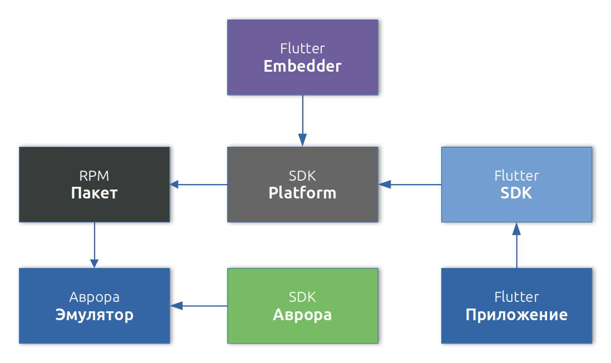

#  Flutter для ОС Аврора

**Flutter** — это фреймворк с открытым исходным кодом от Google для мультиплатформенных приложений,
который позволяет собрать приложение для разных платформ, не модифицируя код проекта.
Flutter поддерживает платформы Android, iOS, Linux, macOS, Windows, Web.

Проект "Flutter для ОС Аврора" реализует поддержку платформы ОС Аврора на фреймворке Flutter.
Реализуя поддержку платформы ОС Аврора, фреймворк, для всех платформ, остается полнофункциональным,
то есть его можно использовать и для разработки других платформ.

В сборке приложений Flutter используются SDK платформы ОС Аврора.
Общая схема сборки приложения от исходного кода по установочного пакета RPM и запуска его на эмуляторе может выглядеть следующим образом:

#### Аврора SDK

Это набор инструментов для создания Qt/QML приложений, сборки, запуска и отладки приложений для ОС Аврора.
С версии `3.16.2-1` Flutter для ОС Аврора стал доступен эмулятор.
В этом SDK доступен эмулятор который можно использовать для разработки приложений на Flutter.

#### Platform SDK

Предназначен для сборки приложений из командной строки и может использоваться в системах CI/CD.
Этот SDK работает совместно с Flutter SDK для сборки установочного RPM пакета.
Его нужно лишь установить, остальную работу на себя берет Flutter SDK.
Так же через Platform SDK есть возможность [подписать](https://developer.auroraos.ru/doc/software_development/guides/package_signing)
пакет для установки на устройство.

#### Flutter SDK

Основной фреймворк для работы с приложениями и плагинами.
Именно с ним напрямую взаимодействует программист разрабатывающий приложения Flutter c помощью
[Flutter CLI](https://docs.flutter.dev/reference/flutter-cli)
и подключением к IDE для работы с кодом проекта.

#### Flutter Embedder

Библиотека написанная на С++ которая обеспечивает работу Flutter непосредственно с операционной системой.
Участвует в сборке и работе приложения.
Устанавливается автоматически Flutter SDK в необходимый таргет Aurora Platform SDK,
до версии `3.16.2-2` устанавливался вручную.

!!! info

    Детальную информацию по SDK можно найти в документации ОС Аврора:

    - [Аврора SDK](https://developer.auroraos.ru/doc/software_development/sdk).
    - [Aurora Platform SDK](https://developer.auroraos.ru/doc/software_development/psdk).
