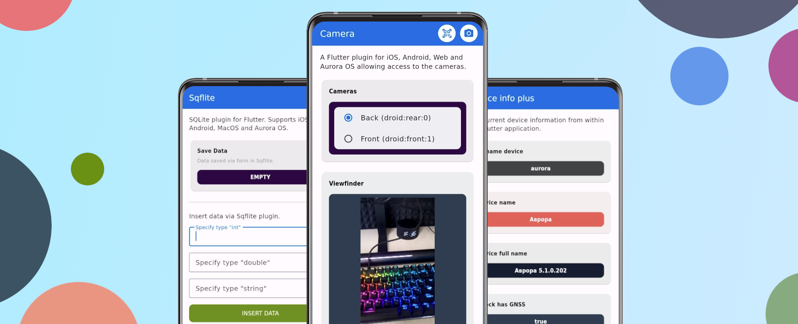

# Плагины Flutter

Плагины важная составляющая всех Flutter приложений.
Они предоставляют основной функционал для разработки приложений на Flutter.
Плагины можно разделить по способу их реализации и по типу общения с операционной системой.

### Типы плагинов

**Платформо-независимые** - плагины, реализованные на инфраструктуре flutter/dart,
не требующие прямого взаимодействия с операционной системой. Например:
[get_it](https://pub.dev/packages/get_it),
[photo_view](https://pub.dev/packages/photo_view).

**Платформо-зависимые** - плагины взаимодействующие с операционной системой через [Flutter Embedder](./components.md#flutter-embedder)
с помощью интерфейса Platform Channel либо FFI.
На ОС Аврора так же доступен платформо-зависимый плагин [dbus](https://pub.dev/packages/dbus)
через который можно реализовать платформо-зависимый плагин. Например:
[camera](https://pub.dev/packages/camera),
[path_provider](https://pub.dev/packages/path_provider)

**Частично-зависимые** - плагины не являющиеся платформо-зависимыми, но зависящие от платформо-зависимых плагинов.
Такие плагины не требуют имплементации для операционной системы, но нужно обеспечить имплементацию их зависимостей.
Например:
[google_fonts](https://pub.dev/packages/google_fonts),
[flutter_cache_manager](https://pub.dev/packages/flutter_cache_manager).

### Доступные плагины

Ключевые плагины реализует компания "Открытая мобильная платформа" для поддержки экосистемы Flutter под операционную систему Аврора.
Есть сторонние плагины разработанные другими компаниями и сообществом специалистов интересующихся разработкой на Flutter.
Вы можете ознакомиться со списком доступных платформо-зависимые плагинов на следующих страницах:

- [Плагины ОМП](../support/omp.md).
- [Плагины сообщества](../support/community.md).



### Client Wrapper

!!! warning

    С версии `3.16.2-2` было решено отказаться от кастомного интерфейса Flutter Embedder для
    стандартизации его интефейса. Это ломает совместимость с некоторыми старыми плагинами, но
    расширяет возможности и унифицирует работу с ними, упрощает портирвоание.

**Client Wrapper** - общий интерфейс Flutter предназначен для встраивания в плагины и приложения для обеспечения абстракции C++ более
высокого уровня для взаимодействия с библиотекой Flutter Embedder. Цель Client Wrapper состоит в том, чтобы переместить больше этого
кода в библиотеку таким образом, чтобы предоставляет удобный ABI (например, не использует стандартную библиотеку в интерфейсах).

Более детально с интерфейсом можно ознакомится на странице репозитория [Flutter Engine](https://github.com/flutter/engine/blob/ba3a70ce7722f4b23f4439e1d06dd1a61f20f581/shell/platform/common/client_wrapper/README).
Интерфейс уже применяется в публичных плагинах, например [flutter_webrtc](https://pub.dev/packages/flutter_webrtc) что позволяет
портировать его на любой Flutter Embedder имеющий общий интерфейс Client Wrapper.

Для ознакомления с новым интерфейсом был разработан демонстрационный плагин с приложением-примером.
Найти его можно в разделе [demo](https://gitlab.com/omprussia/flutter/flutter-plugins/-/tree/main/demo)
репозитория ["Flutter Plugins"](https://gitlab.com/omprussia/flutter/flutter-plugins).


:fontawesome-solid-link: [https://gitlab.com/omprussia/flutter/flutter-plugins/-/tree/main/demo/client_wrapper_demo](https://gitlab.com/omprussia/flutter/flutter-plugins/-/tree/main/demo/client_wrapper_demo)

Демонстрационный плагин отображает работу с такими компонентами Flutter Embedder как:

- `PluginRegistrar` - регистрация платформо-зависимого плагина для последующей работы с ним из Dart.
- `MethodChannel` - регистрация и операции с методами платформо-зависимого плагина из Dart кода.
- `EventChannel` - регистрация, подпись в Dart на события отправляемые из С++ части плагина.
- `TextureRegistrar` - регистрация текстуры и отрисовка буфера пикселей на ней.
- `BinaryMessenger` - низкоуровневый компонент лежащий в базе обмена данными во Flutter Embedder.
- `EncodableValue` - компонент участвующий в обмене данными между компонентами плагина и Flutter.

### Пакет Internal

Для систематизации примеров в плагинах и их упрощения, как их написания, так и чтения, в проекте Flutter Plugins был разработан пакет
[`internal_aurora`](https://gitlab.com/omprussia/flutter/flutter-plugins/-/tree/main/packages/internal_aurora):


:fontawesome-solid-link:
[https://gitlab.com/omprussia/flutter/flutter-plugins/-/tree/main/packages/internal_aurora](https://gitlab.com/omprussia/flutter/flutter-plugins/-/tree/main/packages/internal_aurora)

Пакет содержит следующие компоненты:

- `ListSeparated` - базовый компонент для построения страницы.
- `ListItemInfo` - блок с информацией о плагине, который есть у каждого примера.
- `ListItemData` - элемент списка умеющий обрабатывать значения feature & stream, value.
- `ListButton` - кнопка, стилизованная под примеры.
- `AppBarAction` - стилизованный AppBar.
- `ListItemFormSuccess` - стилизованный блок для форм, отображающих успех.
- `InternalColors` - стандартные цвета для примеров, с расширенным набором.

### README.md

Каждый плагин имеет файл `README.md` с описанием его подключения и основной информацией по нему.
Для стандартизации описания плагина прилагается шаблон, который должен иметь плагин.
Стандартизация упростит, как создание плагина, так и его поддержку.

**Параметры**

* `{PARENT_PLUGIN}` - название плагина, который имплементируется под платформу ОС Аврора.
* `{AURORA_PLUGIN}` - название плагина (`{PARENT_PLUGIN}_aurora`).
* `{AURORA_PLUGIN_DESC}` - дополнительное описание плагина.
* `{PARENT_PLUGIN_VERSION}` - версия имплементируемого плагина.
* `{AURORA_PLUGIN_VERSION}` - версия имплементации плагина.
* `{AURORA_PLUGIN_PERMISSIONS}` - права доступа плагина, если необходимы.
* `{AURORA_PLUGIN_DEPENDENCY}` - зависимости плагина, если необходимы.
* `{AURORA_PLUGIN_LIB_EXCLUDE}` - исключить библиотеки "с собой" из валидации, если необходимо.
* `{EXAMPLE_DART}` - простой пример вызова плагина.

**Шаблон**

```markdown
    # {AURORA_PLUGIN}
    
    The Aurora implementation of [`{PARENT_PLUGIN}`](https://pub.dev/packages/{PARENT_PLUGIN}).
    
    {AURORA_PLUGIN_DESC}
    
    ## Usage
    
    This package is not an _endorsed_ implementation of `{PARENT_PLUGIN}`.
    Therefore, you have to include `{AURORA_PLUGIN}`
    alongside `{PARENT_PLUGIN}` as dependencies in your `pubspec.yaml` file.
    
    **pubspec.yaml**
    
    ```yaml
    dependencies:
    {PARENT_PLUGIN}: ^{PARENT_PLUGIN_VERSION}
    {AURORA_PLUGIN}:
     git:
       url: https://gitlab.com/omprussia/flutter/flutter-plugins.git
       ref: {AURORA_PLUGIN_VERSION}
       path: packages/{PARENT_PLUGIN}/{AURORA_PLUGIN}
    ```
    
    ***main.cpp**
    
    ```c++
    #include <flutter/flutter_aurora.h>
    #include <flutter/flutter_compatibility_qt.h> // <- Add for Qt
    #include "generated_plugin_registrant.h"
    
    int main(int argc, char *argv[]) {
     aurora::Initialize(argc, argv);
     aurora::EnableQtCompatibility(); // <- Enable Qt
     aurora::RegisterPlugins();
     aurora::Launch();
     return 0;
    }
    ```
    
    ***.desktop**
    
    ```desktop
    Permissions={AURORA_PLUGIN_PERMISSIONS}
    ```
    
    ***.spec**
    
    ```spec
    %global __requires_exclude ^lib({AURORA_PLUGIN_LIB_EXCLUDE})\\.so.*$
    
    BuildRequires: pkgconfig({AURORA_PLUGIN_DEPENDENCY})
    ```
    
    ***.dart**
    
    ```dart
    {EXAMPLE_DART}
    ```
```

### Сделать вклад

Вы можете поделиться реализаций платформо-зависимого плагина для платформы ОС Аврора с сообществом через систему
[мерж-реквестов GitLab](https://gitlab.com/omprussia/flutter/flutter-plugins/-/merge_requests).

Что нужно учитывать для реализации плагина:

- Плагин должен поддерживать ОС Аврора поколений 4 и 5.
- `README.md` должно соответствовать шаблону предоставленному выше.
- Имплементация плагина должна иметь название основного плагина + `_aurora` в конце.
- Должен быть реализован пример для плагина с использованием пакета [`internal_aurora`](https://gitlab.com/omprussia/flutter/flutter-plugins/-/tree/main/packages/internal_aurora).
- Желательно свериться с уже существующими плагинами для соблюдения общей структуры.
