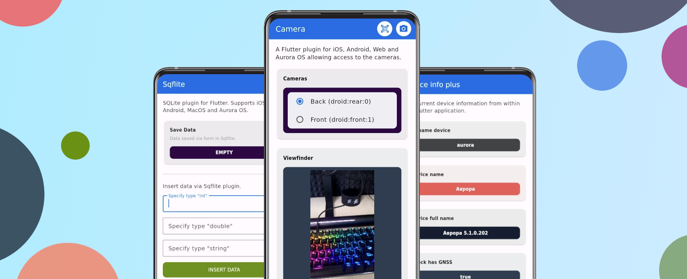

#  Поддержка Flutter платформы ОС Аврора

В этом разделе вы найдете информацию о статусе поддержки платформо-зависимых плагинов для операционной системы Аврора.
Инструменты упрощающую работу с Flutter.
Разработка ведется как компанией "Открытая Мобильная Платформа" так и нашими партнерами, сообществом.

!!! info

    Если вы реализовали плагин на Flutter с поддержкой платформы ОС Аврора, но его нет в списке
    [сторонних плагинов](community.md), и не хотите по каким-то причинам делать мерж-реквест в
    основной репозиторий плагинов, вы можете создать issue в проекте плагинов -
    [Flutter Plugins](https://gitlab.com/omprussia/flutter/flutter-plugins/-/issues),
    мы обработаем заявку и добавим его в список.
    При разработке плагина стоит учитывать некоторые нюансы описанные в разделе
    ["Плагины"](../structure/plugins.md#_3).
